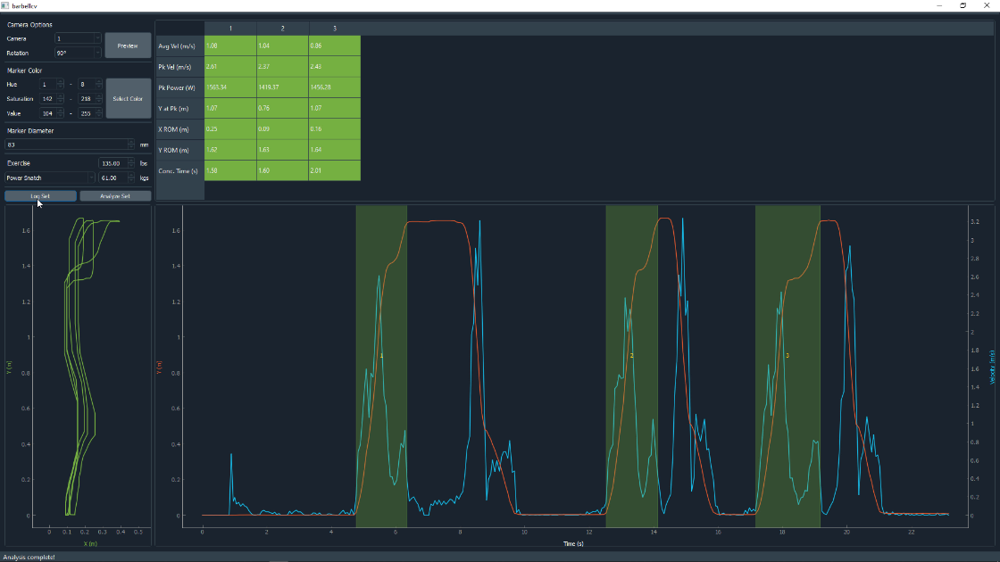
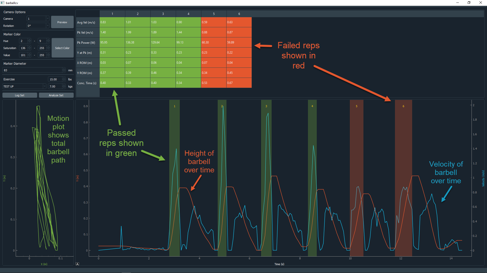

# |||---barbell-cv---|||

Get started with velocity-based training with nothing but a laptop, a webcam,
and a high contrast marker on your barbell.



## Quick Start

1. Download this repository as a .zip file, then unzip it where you like
2. Go to that directory using CMD (Windows) or the terminal (Mac/Linux)
3. Make sure the correct dependencies are installed using pip:
    ```
    python -m pip install requirements.txt
   ```
4. Run the program:
    ```
    python main.py
    ```
5. Preview your webcam using the "Preview" button, and rotate it if needed using the adjacent dropdown.
Press Enter to escape the preview.
6. Select the color of your barbell marker interactively.
    - Press the "Select Color" button
    - Drag your mouse over the marker in the popup (make sure to move the marker around and select it
    under varying light conditions and angles)
    - Press Enter when the marker is tracked satisfactorily
7. Select the exercise you want to do
    - Add exercises that you find missing to the /resources/lifts.json file
8. Input the weight for the set in lbs or kgs (they are synchronized so they will always equal each other)
9. Press "Log Set" and wait for the webcam preview to show before lifting
10. After lifting, press the Enter key to complete the set
11. The results for the set are shown!



## Instructions
*More in-depth instructions coming soon.*

## Limitations
For the video analysis to work correctly on Windows 10 you may need to install the basic
[K-Lite Codec Pack](https://codecguide.com/download_kl.htm).

*As I test this setup more I will learn more about its accuracy and what the limitations are, then update
this section. Suffice it to say that all results should be taken with a grain of salt until verified.*

*If you install this program and use it for your training, I'd love to hear your feedback. For any
bugs or suggestions please open an issue here.*
